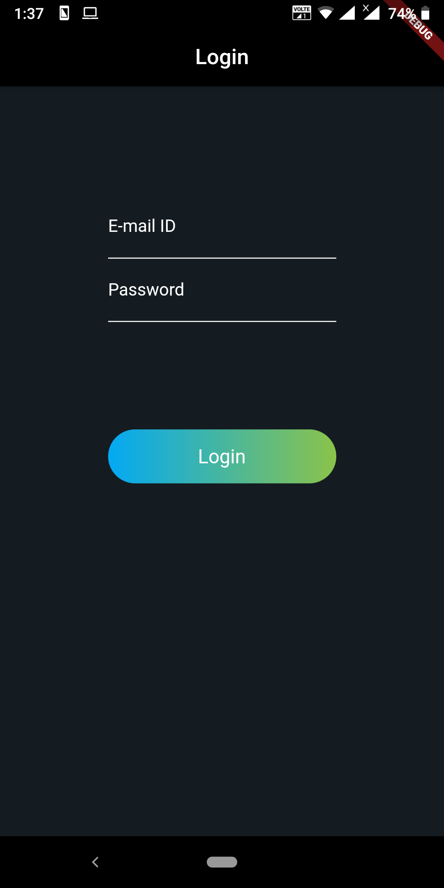

# Flutter_AC
This repository is part of the Flutter Audit Course in Sem V

### Assignment 1
#### Problem Statement
Create a Flutter app demonstrating the use of atleast 2 widgets

#### Screenshot

### Contributors

- [Kaustubh Damania](https://github.com/KaustubhDamania)
- [Mihir Gada](https://github.com/mihir2510)
- [Zenil Haria](https://github.com/zenilharia26)
